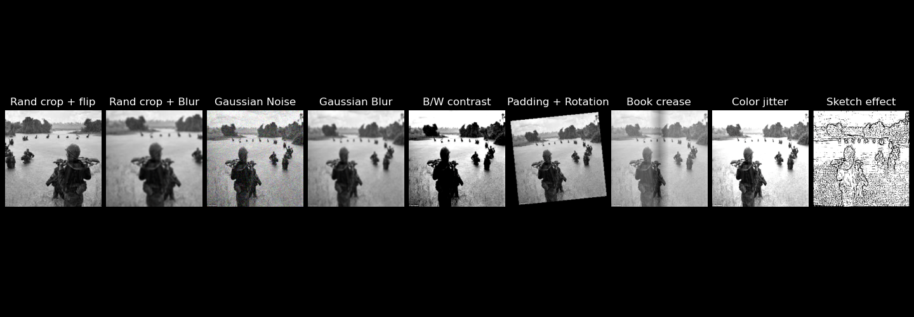

# CBIR Project – Near Duplicate Image Retrieval Using Self-Supervised Learning (SimCLR)

## Context

This project aims to develop a visual representation learning model for Content-Based Image Retrieval (CBIR), specifically targeting the retrieval of near-duplicate images. The application domain focuses on a heritage dataset of historical photographs.


## Installation

1. **Set up the environment**

```bash
git clone https://github.com/Ragnarock-16/CBIR.git
cd <repo-directory>
pip install -r requirements.txt
```

2. **Clean up the dataset**

```bash
python3 -m utils.dataset_cleaning -i <image_path> -gt <ground_truth_path>
```

This will generate a `.txt` file with the absolute paths of the corrupted images.

3. **Training**

```bash
python3 -m train -i <image_path> -gt <ground_truth_path> -b <batch_sz> -e <num_epoch> -lr <learning_rate> -m <simclr or dino>
```

4. **Testing**

```bash
python3 -m utils.test -ip <img_pth> --gt <gt_path> --model <'simclr' or 'dino'> -chk <model_weight_path>
```

## Objective

Implement and adapt a state-of-the-art self-supervised learning method based on SimCLR to learn effective image embeddings for similarity search in the targeted domain.

## Methods

- **Method :** Self-supervised learning approach adapting SimCLR with a fine tuned RESNET backbone to the specific characteristics of historical and/or medical images.

## Pipeline

1. **Embeddings:**  
   Learn image embeddings using SimCLR.

2. **Indexing:**  
   Store the embeddings in FAISS for efficient similarity search.

3. **Near-Duplicate Search:**  
   Perform similarity search to retrieve near-duplicate images.
## Evaluation Metrics

- **Precision@K:**  
  The proportion of the top K retrieved images that are true near-duplicates.

- **Recall@K:**  
  The proportion of all true near-duplicates that are found in the top K retrieved images. It reflects the model’s ability to find as many relevant images as possible within the top K.

- **F1-score@K:**  
  The harmonic mean of Precision@K and Recall@K, providing a balance between precision and recall in the top K results.

- **Mean Average Precision (mAP)@K:**  
  The average precision computed across all queries considering the top K retrieved images, which summarizes both precision and recall across different recall levels.

## Augmentation Strategy

We implemented and compared two augmentation strategies:

1. **SimCLR Augmentation Strategy:**  
   This follows the original SimCLR approach, which includes strong random augmentations such as Gaussian blur, color jitter, random grayscale conversion, random cropping, and horizontal flipping. These augmentations aim to create diverse positive pairs while preserving the semantic content of the images.

2. **Domain-Informed Augmentation Strategy :**  
   This strategy is tailored to the specific nature of our dataset (historical photographs). It includes augmentations chosen to preserve domain-relevant features and avoid distortions that could alter important details.

<p align="center">
  
</p>

## Indexation

We explored two main approaches for retrieving similar images using embeddings:

1. **K-Nearest Neighbors (KNN):**
   - Computes distances between all embeddings to find the closest matches.(see @K metrics)
   - Simple and effective for small datasets but not scalable.

2. **Facebook AI Similarity Search (FAISS):**
   - Builds an efficient index to organize embeddings for fast retrieval.
   - Highly scalable and much faster than brute-force KNN (up to 10× speedup).
   - Flexible, supporting large datasets and approximate search.

It's preferable to use **FAISS** due to its speed, scalability, and efficiency in handling large-scale image embeddings.

## Results

The retrieval performance and training parameters for different models on the near-duplicate search task are summarized below:
| Model    | Precision@1 | Recall@1 | Precision@5 | Recall@5 | F1@5   | Precision@10 | Recall@10 | F1@10  | mAP@5  | mAP@10 |
|----------|-------------|----------|-------------|----------|--------|---------------|-----------|--------|--------|--------|
| RESNET-50 | 0.4496      | 0.1337   | 0.241       | 0.2885   | 0.2362 | 0.1475        | 0.3402    | 0.1875 | 0.2483 | 0.2652 |
| DINO     | 0.759       | 0.2457   | 0.5         | 0.6007   | 0.488  | 0.3144        | 0.6905    | 0.3903 | 0.5553 | 0.6088 |

| Model  | Batch Size | Learning Rate | Projection Dim | Temperature | Augmentations | Precision@1 | Recall@1 | Precision@5 | Recall@5 | F1@5   | Precision@10 | Recall@10 | F1@10  | mAP@5  | mAP@10 |
|--------|------------|---------------|----------------|-------------|---------------|-------------|----------|-------------|----------|--------|--------------|-----------|--------|--------|--------|
| run1   | 32         | 0.01          | 64             | 0.5         | Custom        | 0.241       | 0.0602   | 0.1324      | 0.1638   | 0.1323 | 0.0975       | 0.2324    | 0.1265 | 0.1184 | 0.1368 |
| run2   | 128        | 0.001         | 64             | 0.5         | Custom        | 0.446       | 0.1285   | 0.2576      | 0.3249   | 0.2592 | 0.1701       | 0.4071    | 0.2209 | 0.2756 | 0.3032 |
| run3   | 128        | 0.001         | 128            | 0.5         | Custom       | 0.446       | 0.1275   | 0.2345      | 0.2953   | 0.2352 | 0.1745       | 0.4146    | 0.2264 | 0.2411 | 0.2791 |
| run4   | 32         | 0.01          | 64             | 0.5         | SimCLR        | 0.0719      | 0.0142   | 0.0446      | 0.0507   | 0.0432 | 0.0324       | 0.0781    | 0.0417 | 0.0297 | 0.0349 |

## Configuration

- **Encoder:** ResNet50  
- **Learning Rate:** 1e-3  
- **Epochs:** 20  
- **Optimizer:** AdamW  
- **Temperature:** 0.5  
- **Training Time:** ~10 hours on 2xT4

---

## Conclusion

- Contrastive learning is well-suited to the task.  
- Limitations due to high resource consumption.  
- Importance of data augmentation.  
- More promising results with DINO.

---

## Supervisors and Contributors

- **Supervisor:** Camille KURTZ  
- **Other contributors:** Dorian GROUTEAU and Samuel GONÇALVES (same task other approach).
